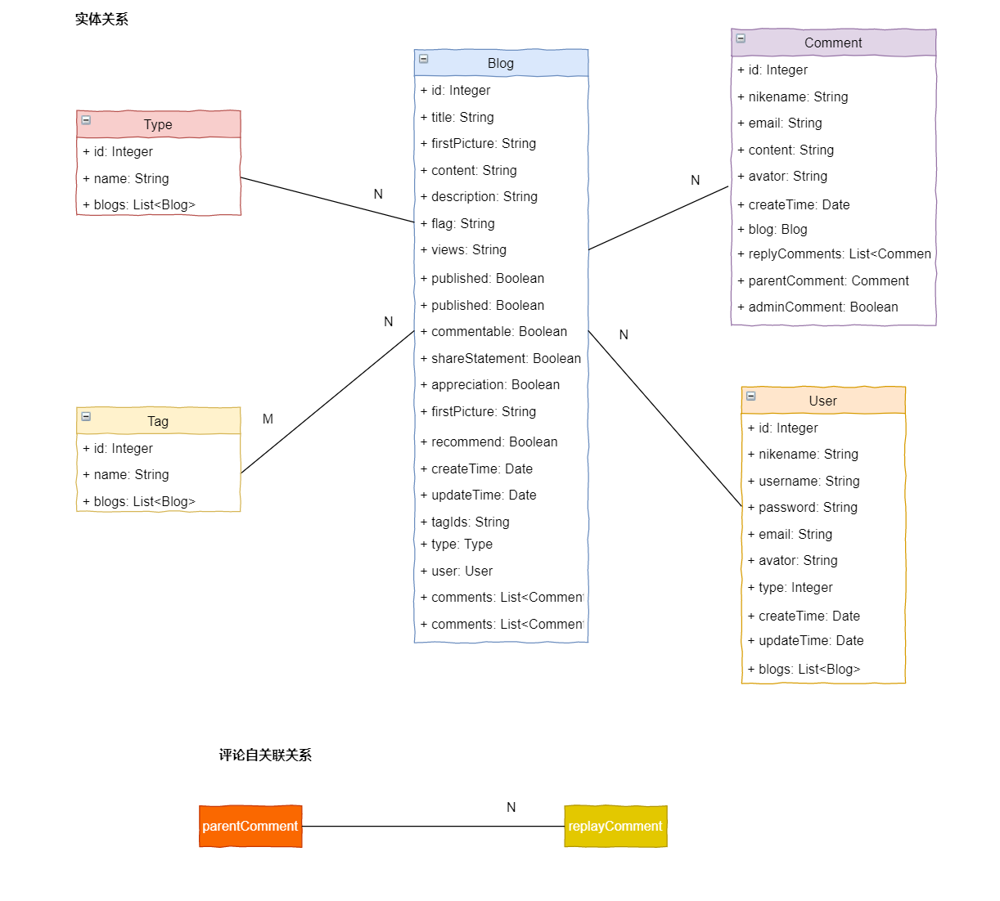

# Spring-Boot-Blog

### 功能概览

个人博客所提供的功能大致如下图所示：

[功能概览](https://typora-forlogen.oss-cn-shenzhen.aliyuncs.com/img/%E4%B8%AA%E4%BA%BA%E5%8D%9A%E5%AE%A2%E8%84%91%E5%9B%BE.jpg)

功能整体上分为两大部分：

- 管理员
  - 登录
  - 博客CRUD
  - 类别CRUD
  - 标签CRUD
- 前端展示
  - 博客首页
  - 博客分类
  - 博客标签
  - 博客归档
  - 导航栏、底部

___

### 技术选型

- 前端：HTML、CSS、JS、[**Thymleaf**](https://www.thymeleaf.org/)、[**Semantic UI**](https://semantic-ui.com/)

- 后端：[**Spring Boot**](https://spring.io/projects/spring-boot)、[**Spring Data Jpa**](https://spring.io/projects/spring-data-jpa)

- 数据库：MySQL

- 工具：IDEA、JDK8、Maven3

- 插件：

  - [编辑器 Markdown](https://pandao.github.io/editor.md/)

  - [内容排版 typo.css](https://github.com/sofish/typo.css)

  - [动画 animate.css](https://daneden.github.io/animate.css/)

  - [代码高亮 prism](https://github.com/PrismJS/prism)

  - [目录生成 Tocbot](https://tscanlin.github.io/tocbot/)

  - [滚动侦测 waypoints](http://imakewebthings.com/waypoints/)

  - [平滑滚动 jquery.scrollTo](https://github.com/flesler/jquery.scrollTo)
  - [二维码生成 qrcode.js](https://davidshimjs.github.io/qrcodejs/)

  
___


#### 配置文件

这里配置文件采用yaml格式，当然properties格式的配置文件同样可以。首先编写全局的配置文件application.yaml

```yaml	
spring:
  thymeleaf:
    mode: HTML
  # 运行环境
  profiles:
    active: dev
    # 国际化
    messages:
      basename: i18n/messages
```

为了适配于不同的应用环境，创建application-dev.yaml和application-pro.yaml分别用于开发环境和生产环境

```yaml 
########################
# application-dev.yaml
########################
spring:
  # 配置数据源
  datasource:
    driver-class-name: com.mysql.cj.jdbc.Driver
    url: jdbc:mysql://localhost:3306/blog?serverTimezone=GMT&useUnicode=true&characterEncoding=UTF-8
    username: root
    password: 123456
  # Jpa相关配置项
  jpa:
    hibernate:
      # 根据实体类自动创建表
      ddl-auto: update
    # 自动打印sql语句
    show-sql: true

# 日志配置
logging:
  # 日志级别
  level:
    root: info
    com.lrm: debug
 # 日志文件目录
 file:
    name: log/blog-dev.log
```

```yaml
########################
# application-pro.yaml
########################
spring:
  datasource:
    driver-class-name: com.mysql.cj.jdbc.Driver
    url: jdbc:mysql://localhost:3306/blog?serverTimezone=GMT&useUnicode=true&characterEncoding=UTF-8
    username: root
    password: 123456
  jpa:
    hibernate:
      ddl-auto: none
    show-sql: true

logging:
  level:
    root: warn
    com.lrm: info
  file:
    name: log/blog-pro.log
server:
  port: 8081
```

同时也可以添加Spring Boot默认的日志logback的相关配置，编写配置文件logback-spring.xml

```xml
<?xml version="1.0" encoding="UTF-8" ?>
<configuration>
    <!--包含Spring boot对logback日志的默认配置-->
    <include resource="org/springframework/boot/logging/logback/defaults.xml" />
    <property name="LOG_FILE" value="${LOG_FILE:-${LOG_PATH:-${LOG_TEMP:-${java.io.tmpdir:-/tmp}}}/spring.log}"/>
    <include resource="org/springframework/boot/logging/logback/console-appender.xml" />

    <!--重写了Spring Boot框架 org/springframework/boot/logging/logback/file-appender.xml 配置-->
    <appender name="TIME_FILE"
              class="ch.qos.logback.core.rolling.RollingFileAppender">
        <encoder>
            <pattern>${FILE_LOG_PATTERN}</pattern>
        </encoder>
        <file>${LOG_FILE}</file>
        <rollingPolicy class="ch.qos.logback.core.rolling.TimeBasedRollingPolicy">
            <fileNamePattern>${LOG_FILE}.%d{yyyy-MM-dd}.%i</fileNamePattern>
            <!--保留历史日志一个月的时间-->
            <maxHistory>30</maxHistory>
            <!--
            Spring Boot默认情况下，日志文件10M时，会切分日志文件,这样设置日志文件会在100M时切分日志
            -->
            <timeBasedFileNamingAndTriggeringPolicy class="ch.qos.logback.core.rolling.SizeAndTimeBasedFNATP">
                <maxFileSize>10MB</maxFileSize>
            </timeBasedFileNamingAndTriggeringPolicy>

        </rollingPolicy>
    </appender>

    <root level="INFO">
        <appender-ref ref="CONSOLE" />
        <appender-ref ref="TIME_FILE" />
    </root>

</configuration>
```


###  实体类设计

这里通过Jpa来使用面向对象的思想根据实体类自动的创建表，所以并不需要在数据库中显式的创建表，并设置表之间的映射关系。首先分析一下博客系统所设计的实体类：

- 博客类：Blog
- 类别类：Type
- 标签类：Tag
- 评论类：Comment
- 用户类：User

它们之间的关系如下所示：



除了不同实体类之间的关系，由于博客评论这里设计为两级结构，因此父评论和下面的子评论还存在一对多的关系。

### 命名约定

**Service/DAO层命名约定：**

*  获取单个对象的方法用get做前缀。
*  获取多个对象的方法用list做前缀。
*  获取统计值的方法用count做前缀。
*  插入的方法用save(推荐)或insert做前缀。
*  删除的方法用remove(推荐)或delete做前缀。
*  修改的方法用update做前缀。

___

### 应用分层

https://typora-forlogen.oss-cn-shenzhen.aliyuncs.com/img/%E5%BA%94%E7%94%A8%E5%88%86%E5%B1%82.png
